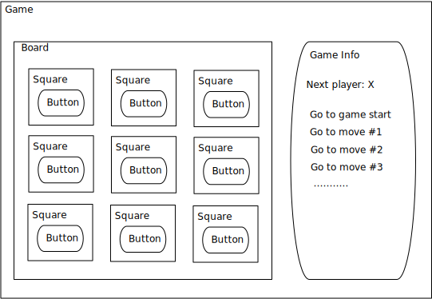

== Run the application

In the root folder of the project `tictactoe`, execute the following command to install all dependencies.

[source,bash]
----
npm install
----

In `package.json`, a `start` script for starting the Webpack Dev Server serving the application is defined. To start the application, run

[source,bash]
----
npm start
----

The Tic-tac-toe web app is served at port 8080.

== React components architecture

As typical with React applications, the first step is to design a tree of React components to represent the application.

The root React component is `Game` that consists of two areas. The left area is the React component `Board` showing the Tic-tac-toe board while the right area shows the game information.

== N4JS type definitions of React

In order to make use of N4JS's type checking for React, we need to declare `@n4jsd/react` as dev dependency in `package.json`. `@n4jsd/react` consists of n4jsd files that contain file definitions for React.

[source,typescript]
----
{
    "name": "tictactoe",
    "devDependencies": {
    	"@n4jsd/react": "<=16.6.*",
    },

    "dependencies": {
        "react": "^16.6.0",
    }
}
----

== File extension n4jsx

The standard file extension of N4JS is `.n4js`. N4JS files containing React and JSX must have the extension `.n4jsx`.

== Square React component

In the tree of React components in this application, `Square` is a leaf React component. It defines a single square of the Tic-tac-toe board that can be clicked by the current user. Its value is either `X` or `O` or `null` depending on which user is in turn or if the square is empty. In this example, we define Square as a lightweight functional component since it does not have any state.

[source,typescript]
----
/**
 * Square props
 */
interface ~SquareProps extends React.ComponentProps {
    public value: string;
    public onClick: {function(): void}
}

/**
 * Square React component
 */
function Square(props: SquareProps): React.Element<?> {
  return (
    <button className="square" onClick={props.onClick}>
      {props.value}
    </button>
  );
}
----

The functional definition of `Square`, in fact of any React component, must have a single `props` parameter of a subtype of `React.ComponentProps` and return an instance of type `React.Element<?>`. In this example, `SquareProps` dictates that when a `Square` is instantiated, it expects two _mandatory_ `props`:

* `value`: the value of the square, either `X`, `O` or `null`. This is necessary because the states of the squares are managed by a parent React component.

* `onClick`: the event handler to be called when the square is clicked. `Square` component uses this event handler to inform a parent component to update the state.

In addition to having explicit types, the props can be declared as mandatory (as in this example) or _optional_ with the help of the question mark. For instance,  if we declare `public value?: string`, it means that `value` would be an optional property when creating `Square`.

Here we start to see the advantages of N4JS over the pure non-type JavaScript implementation. When a `Square` component is created, the compiler will enforce the type of the props. Moreover, it will complain if a mandatory prop is missing. And all these checks happen _at compile time_ during development. In pure JavaScript, we will recognize those mistakes much later _at runtime_, possibly during production.

== Board component
The `Board` React component represents the Tic-tac-toe board. Even though it does not have state, we define it as a class because it contains a helper method.

[source,typescript]
----
/**
 * Board props
 */
interface ~BoardProps extends React.ComponentProps {
    public squares: [string];
    public onClick: {function(int): void}
}

/**
 * Board React component
 */
class Board extends React.Component<BoardProps, Object> {
  /**
   * Render the i-th square on the board
   */
  renderSquare(i: int) {
    return (
      <Square
        value={this.props.squares[i]}
        onClick={() => this.props.onClick(i)}
      />
    );
  }

  @Override
  public render(): React.Element<?> {
    return (
      

        

          {this.renderSquare(0)}
          {this.renderSquare(1)}
          {this.renderSquare(2)}
        

        

          {this.renderSquare(3)}
          {this.renderSquare(4)}
          {this.renderSquare(5)}
        

        

          {this.renderSquare(6)}
          {this.renderSquare(7)}
          {this.renderSquare(8)}
        

      

    );
  }
}
----

The Board class, as any class representing a `React component`, must extend `React.Component`. Note that `React.Component` expects two type arguments: the first type argument is the type of props and the second type argument is the type of state. Here, in the `render` method we simply create 3x3 Squares that make up the board.

== Game React component
This is the root React component of this application and hence does not have any props. Instead, it has state represented by GameState which stores the history of the board as an array of states, the step number and whether the next player is `X`.

[source,typescript]
----
/**
 * Game state
 */
interface ~GameState {
    public history: Array<~Object with { squares: Array<string>}>;
    public stepNumber: int;
    public xIsNext: boolean;
}

/**
 * Game React component (root)
 */
export default public class Game extends React.Component<React.ComponentProps, GameState> {

  public constructor(props: React.ComponentProps) {
    super(props);
    this.state = {
      history: [
        {
          squares: new Array<string>(9)
        }
      ],
      stepNumber: 0,
      xIsNext: true
    };
  }

  ...

  @Override
  public render(): React.Element<?> {
  ...
  }
}
----

Here, again thanks to type checking, the N4JS compiler will complain if we access a non-existing field of `GameState` or use the wrong type of a certain field of `GameState` _at compile time_. In pure JavaScript, we will recognize those mistakes only at runtime.
